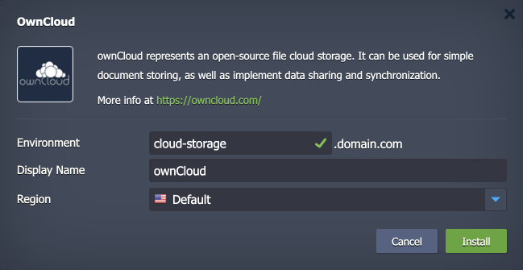

 

# ownCloud

The application package deploys the ownCloud cloud storage solution - a free, open-source software project for content collaboration, sharing, and file synchronization.

## Environment Topology

The package creates a new ownCloud environment that consists of one application server and one database container. It deploys and sets the ownCloud application. Additionally, the automatic vertical (per container) and horizontal scaling are configured out of the box. The default software stacks utilized in the package are the following:

- Apache 2 PHP application server (PHP 7.4)
- MySQL 8 database
- OwnCloud 10.15.0

## Deployment to Cloud

To get your ownCloud solution, click the "**Deploy to Cloud**" button below, specify your email address within the widget, choose one of the [Virtuozzo Public Cloud Providers](https://www.virtuozzo.com/application-platform-partners/), and confirm by clicking **Install**.

> If you already have a Virtuozzo Application Platform (VAP) account, you can deploy this solution from the [Marketplace](https://www.virtuozzo.com/application-platform-docs/marketplace/) or [import](https://www.virtuozzo.com/application-platform-docs/environment-import/) a manifest file from this repository.

## Installation Process

In the opened installation window at the VAP dashboard, provide a preferred environment and display names, choose a region (if available), and confirm the installation.

Your ownCloud application will be automatically installed in a few minutes.
